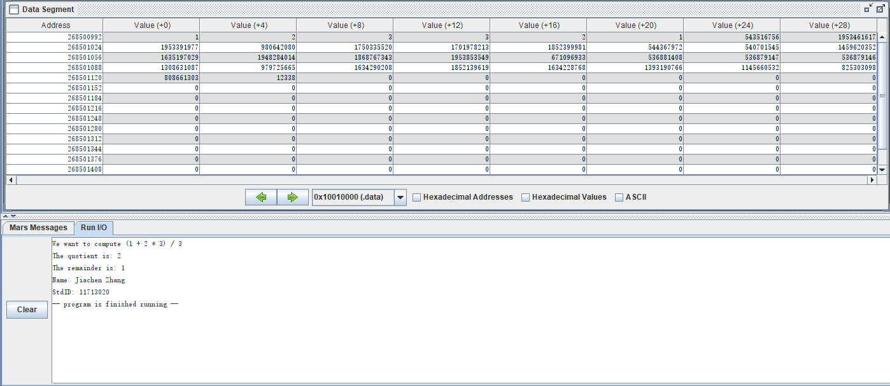
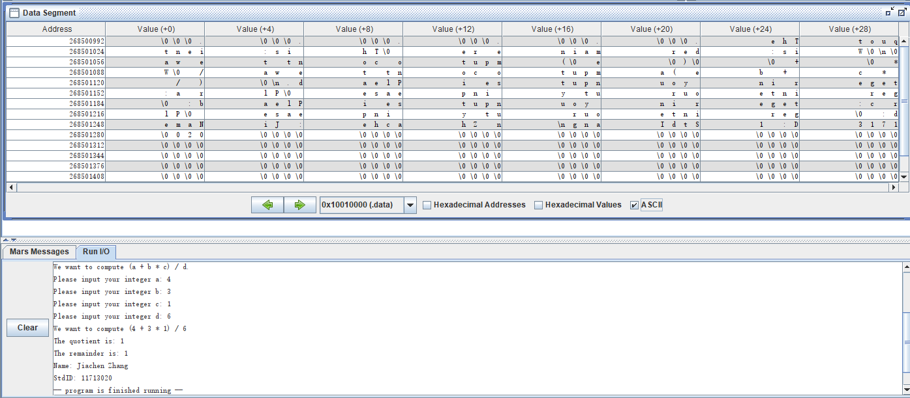
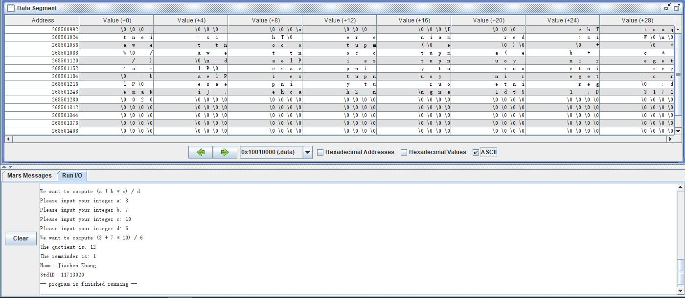
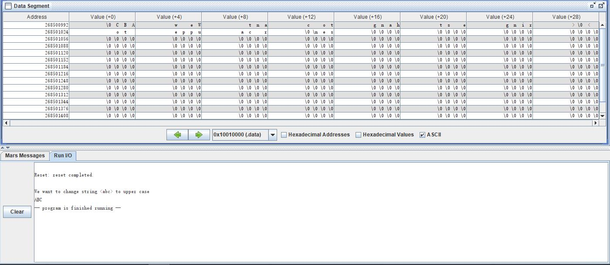

<center><font size="6">计算机组成原理实验报告</font><center/>

<center>姓名： 张佳晨              学号：11713020<center/>


## 一、 实验目的

1. Learn about compilers translating assembly language into machine language, which can be executed directly on a specific computer.

2. Learn to code assembly language called MIPS and use the assembler named MARS.

3. Know the differences between high-level programming language (like Java) and the assembly language (like MIPS).

4. Understand the process of MIPS's processing instructions, including data loading and storing, registers and three kind of addressing (load address, indirect addressing and based or indexed addressing).

5. Learn to use Arithmetic instructions and system calls(dominantly about I/O processing).

## 二、 实验内容

1. Use `.data` to make data declare section, which follows the program code section, to declare user defined variables.
2. Use system calls to prompt users inputting an integer and store it.
3. Use load instructions to load data on the memory.
4. Use arithmetic instructions to make computations.
5. Use indexed addressing and load byte instruction to get a character, which occupies only one byte.
6. Make use of the registers to help processing data.

## 三、 实验步骤（阐述代码思路或操作步骤）

> 代码思路与操作步骤均在详细的注释中展示

### Problem 1.1

```python
# text segment
    .text
    .global main
main:                       # execution starts here
    jal printProblem
    # In order to compute, $a0 = a, $a1 = b, $a2 = c, $a3 = d
    lw $a0, a
    lw $a1, b
    lw $a2, c
    lw $a3, d
    jal Compute             # compute (a + b * c) / d
    # print result
    jal printResult

    li $v0, 10              # system call to exit
    syscall
    

printProblem:
    # we want to compute 
    la $a0, print_str1
    li $v0, 4    # system call to print string ($a0 = address)
    syscall
    # we want to compute (
    la $a0, print_LP
    li $v0, 4    # system call to print string ($a0 = address)
    syscall
    # we want to compute (a
    lw $a0, a
    li $v0, 1    # system call to print integer ($a0 = integer)
    syscall
    # we want to compute (a + 
    la $a0, print_plus
    li $v0, 4    # system call to print string ($a0 = address)
    syscall
    # we want to compute (a + b
    lw $a0, b
    li $v0, 1    # system call to print integer ($a0 = integer)
    syscall
    # we want to compute (a + b *
    la $a0, print_mult
    li $v0, 4    # system call to print string ($a0 = address)
    syscall
    # we want to compute (a + b * c
    lw $a0, c
    li $v0, 1    # system call to print integer ($a0 = integer)
    syscall
    # we want to compute (a + b * c)
    la $a0, print_RP
    li $v0, 4    # system call to print string ($a0 = address)
    syscall
    # we want to compute (a + b * c) /
    la $a0, print_slash
    li $v0, 4    # system call to print string ($a0 = address)
    syscall
    # we want to compute (a + b * c) / d
    lw $a0, d
    li $v0, 1    # system call to print integer ($a0 = integer)
    syscall
    la $a0, print_newLine
    li $v0, 4    # system call to print string ($a0 = address)
    syscall
# compute (a + b * c) / d, store result in quotient and remainder
Compute:    # $a0 = a, $a1 = b, $a2 = c, $a3 = d
    # $t1 = b * c
    mult $a1, $a2           # (Hi, Lo) = $t3 * $t4
    mflo $t1                # $t1 = Lo
    # $t0 = a + b * c
    add $t0, $a0, $t1       # $t0 = $a0 + $t1
    # (a + b * c) / d
    div $t0, $a3            # Lo = $t0 / $t1    Hi = $t0 % $t1
    
    # store the quotient and the remainder
    mfhi $t0                # $t0 = Hi
    sw $t0, remainder       # remainder = (a + b * c) % d
    mflo $t0                # $t0 = Lo
    sw $t0, quotient        # quotient = (a + b * c) / d
    jr $ra

printResult:    
    # print quotient
    la $a0, print_quotient
    li $v0, 4    # system call to print string ($a0 = address)
    syscall
    lw $a0, quotient
    li $v0, 1    # system call to print integer ($a0 = integer)
    syscall
    la $a0, print_newLine
    li $v0, 4    # system call to print string ($a0 = address)
    syscall

    # print_remainder
    la $a0, print_remainder
    li $v0, 4    # system call to print string ($a0 = address)
    syscall
    lw $a0, remainder
    li $v0, 1    # system call to print integer ($a0 = integer)
    syscall
    la $a0, print_newLine
    li $v0, 4    # system call to print string ($a0 = address)
    syscall

    jr $ra

# data segment
    .data
# name storge_type values
a:      .word   1       # create a single integer:
                        # variable with initial value 1
b:      .word   2       # create a single integer:
                        # variable with initial value 2
c:      .word   3       # create a single integer:
                        # variable with initial value 3
d:      .word   3       # create a single integer:
                        # variable with initial value 3
quotient:   .word 0
remainder:  .word 0
print_quotient: .asciiz "The quotient is: "
print_remainder: .asciiz "The remainder is: "
print_newLine: .asciiz "\n"
print_str1: .asciiz "We want to compute "
print_LP: .asciiz "("    #left parenthesis
print_RP: .asciiz ")"   #right parenthesis
print_plus: .asciiz " + "   #right parenthesis
print_mult: .asciiz " * "
print_slash: .asciiz " / "
```

### Problem 1.2

```python
# text segment
    .text
    .global main
main:                       # execution starts here
    jal printPrompt
    jal printProblem
    # In order to compute, $a0 = a, $a1 = b, $a2 = c, $a3 = d
    lw $a0, a
    lw $a1, b
    lw $a2, c
    lw $a3, d
    jal Compute             # compute (a + b * c) / d
    # print result
    jal printResult
    
    # print my information
    la $a0, print_myInfo
    li $v0, 4    # system call to print string ($a0 = address)
    syscall

    li $v0, 10              # system call to exit
    syscall
    
printPrompt:
    la $a0, print_question
    li $v0, 4    # system call to print string ($a0 = address)
    syscall
    # a-prompt
    la $a0, print_promptA
    li $v0, 4    # system call to print string ($a0 = address)
    syscall
    # a - read
    li $v0, 5               # system call to read_int in v0
    syscall
    sw $v0, a               # put integer address into a0
    # b-prompt
    la $a0, print_promptB
    li $v0, 4    # system call to print string ($a0 = address)
    syscall
    # b - read
    li $v0, 5               # system call to read_int in v0
    syscall
    sw $v0, b               # put integer address into a0
    # c-prompt
    la $a0, print_promptC
    li $v0, 4    # system call to print string ($a0 = address)
    syscall
    # c - read
    li $v0, 5               # system call to read_int in v0
    syscall
    sw $v0, c               # put integer address into a0
    # d-prompt
    la $a0, print_promptD
    li $v0, 4    # system call to print string ($a0 = address)
    syscall
    # d - read
    li $v0, 5               # system call to read_int in v0
    syscall
    sw $v0, d               # put integer address into a0
    jr $ra

printProblem:
    # we want to compute 
    la $a0, print_str1
    li $v0, 4    # system call to print string ($a0 = address)
    syscall
    # we want to compute (
    la $a0, print_LP
    li $v0, 4    # system call to print string ($a0 = address)
    syscall
    # we want to compute (a
    lw $a0, a
    li $v0, 1    # system call to print integer ($a0 = integer)
    syscall
    # we want to compute (a + 
    la $a0, print_plus
    li $v0, 4    # system call to print string ($a0 = address)
    syscall
    # we want to compute (a + b
    lw $a0, b
    li $v0, 1    # system call to print integer ($a0 = integer)
    syscall
    # we want to compute (a + b *
    la $a0, print_mult
    li $v0, 4    # system call to print string ($a0 = address)
    syscall
    # we want to compute (a + b * c
    lw $a0, c
    li $v0, 1    # system call to print integer ($a0 = integer)
    syscall
    # we want to compute (a + b * c)
    la $a0, print_RP
    li $v0, 4    # system call to print string ($a0 = address)
    syscall
    # we want to compute (a + b * c) /
    la $a0, print_slash
    li $v0, 4    # system call to print string ($a0 = address)
    syscall
    # we want to compute (a + b * c) / d
    lw $a0, d
    li $v0, 1    # system call to print integer ($a0 = integer)
    syscall
    la $a0, print_newLine
    li $v0, 4    # system call to print string ($a0 = address)
    syscall
    jr $ra
# compute (a + b * c) / d, store result in quotient and remainder
Compute:    # $a0 = a, $a1 = b, $a2 = c, $a3 = d
    # $t1 = b * c
    mult $a1, $a2           # (Hi, Lo) = $t3 * $t4
    mflo $t1                # $t1 = Lo
    # $t0 = a + b * c
    add $t0, $a0, $t1       # $t0 = $a0 + $t1
    # (a + b * c) / d
    div $t0, $a3            # Lo = $t0 / $t1    Hi = $t0 % $t1
    
    # store the quotient and the remainder
    mfhi $t0                # $t0 = Hi
    sw $t0, remainder       # remainder = (a + b * c) % d
    mflo $t0                # $t0 = Lo
    sw $t0, quotient        # quotient = (a + b * c) / d
    jr $ra

printResult:    
    # print quotient
    la $a0, print_quotient
    li $v0, 4    # system call to print string ($a0 = address)
    syscall
    lw $a0, quotient
    li $v0, 1    # system call to print integer ($a0 = integer)
    syscall
    la $a0, print_newLine
    li $v0, 4    # system call to print string ($a0 = address)
    syscall

    # print_remainder
    la $a0, print_remainder
    li $v0, 4    # system call to print string ($a0 = address)
    syscall
    lw $a0, remainder
    li $v0, 1    # system call to print integer ($a0 = integer)
    syscall
    la $a0, print_newLine
    li $v0, 4    # system call to print string ($a0 = address)
    syscall

    jr $ra

# data segment
    .data
# name storge_type values
a:      .word   1       # create a single integer:
                        # variable with initial value 1
b:      .word   2       # create a single integer:
                        # variable with initial value 2
c:      .word   3       # create a single integer:
                        # variable with initial value 3
d:      .word   3       # create a single integer:
                        # variable with initial value 3
quotient:   .word 0
remainder:  .word 0
print_quotient: .asciiz "The quotient is: "
print_remainder: .asciiz "The remainder is: "
print_newLine: .asciiz "\n"
print_str1: .asciiz "We want to compute "
print_LP: .asciiz "("    #left parenthesis
print_RP: .asciiz ")"   #right parenthesis
print_plus: .asciiz " + "   #right parenthesis
print_mult: .asciiz " * "
print_slash: .asciiz " / "
print_question: .asciiz "We want to compute (a + b * c) / d.\n"
print_promptA:  .asciiz "Please input your integer a: "
print_promptB:  .asciiz "Please input your integer b: "
print_promptC:  .asciiz "Please input your integer c: "
print_promptD:  .asciiz "Please input your integer d: "
print_myInfo: .asciiz "Name: Jiachen Zhang\nStdID: 11713020"

# reference:
# mult $t3, $t4         # (Hi, Lo) = $t3 * $t4
# add  $t0, $t1, $t2    # $t0 = $t1 + $t2
# mfhi $t0              # $t0 = Hi
# mflo $t1              # $t1 = Lo
# move $t1, $t2         # $t2 = t3
# div  $t5, $t6         # Lo = $t5 / $t6    Hi = $t5 % $t6
```

### Problem 2

```python
# change string "abc" to "ABC"
# text segment
    .text
    .global main
main:                       # execution starts here
    jal printQuestion
    jal lowerToUpper
    la $a0, str
    li $v0, 4    # system call to print string ($a0 = address)
    syscall

    li $v0, 10              # system call to exit
    syscall

lowerToUpper:
    la $a0, str
    lb $t1, 0($a0)
    lb $t2, 1($a0)
    lb $t3, 2($a0)
    subi	$t0, $t1, 32		# $t0 = $t1 - 32
    sb $t0, 0($a0)
    subi	$t0, $t2, 32		# $t0 = $t1 - 32
    sb $t0, 1($a0)
    subi	$t0, $t3, 32		# $t0 = $t1 - 32
    sb $t0, 2($a0)
    
    jr $ra

printQuestion:
    la $a0, print_str1
    li $v0, 4    # system call to print string ($a0 = address)
    syscall
    la $a0, str
    li $v0, 4    # system call to print string ($a0 = address)
    syscall
    la $a0, print_str2
    li $v0, 4    # system call to print string ($a0 = address)
    syscall
    jr $ra

# data segment
    .data
str:    .asciiz "abc"
print_str1: .asciiz "We want to change string <"
print_str2: .asciiz "> to upper case\n"

```

## 四、 实验结果（截图并配以适当的文字说明）

### Problem 1.1



> Here I initially set a = 1, b = 2, c = 3 and d = 3.

> I print the formula on the screen.

> I store the result in the variables named quotient and remainder.

### Problem 1.2



> I set a, b, c, d equals 4, 3, 1, 6, respectively.

> The result is (4 + 3 * 1)  / 6 = 1 ······ 1



> I set a, b, c, d equals 3, 7, 10, 6, respectively.

> The result is (3 + 7 * 10)  / 6 = 12 ······ 1

### Problem 2



> I change the string `abc` to `ABC` at the same memory address.

## 五、 实验分析（遇到的问题以及解决方案）

P1: I could not directly use the arithmetic instruction to processing data on the memory.

> Arithmetic instruction only compute data on the registers.

P2: I could not get the `a` by using `lw` instruction.

> The character `a` store in one byte while `lw` instruction access one word data, which is four bytes.
>
> So in order to get only `a`, I need to use `lb` instruction and the indexed access addressing to get `b` and `c`.

## 六、 实验小结与体会

1. For assembly language, instructions executing is based on the address and only has the ability to compute data on the registers directly, so the data accessing, loading and storing is a significant procedure for assembly code. 
2. The comments is very important for writing assembly codes as one simple instruction (for high-level language) is constructed by many assembly instruction, because of the data accessing.
3. I should have a clearly concept about whether I am going to get address or the data on the memory which has the specific address.