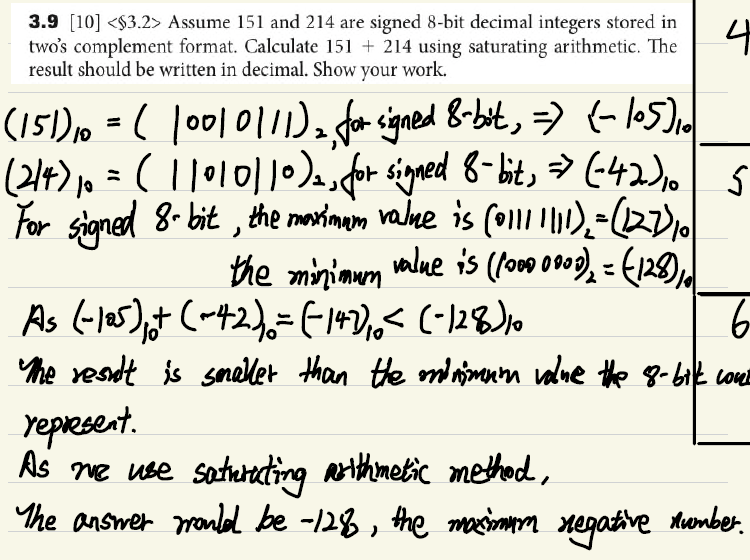
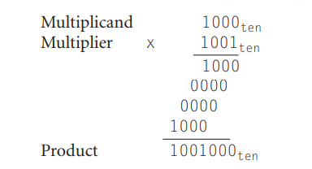
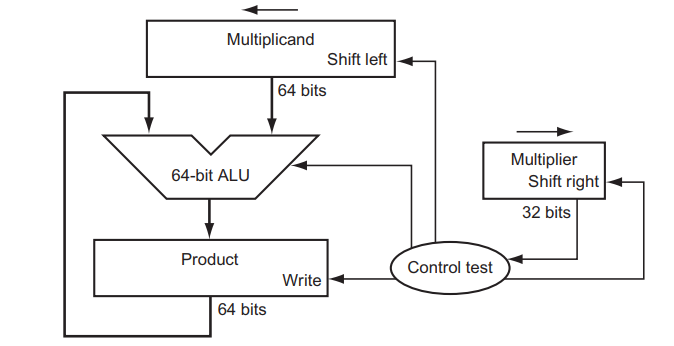
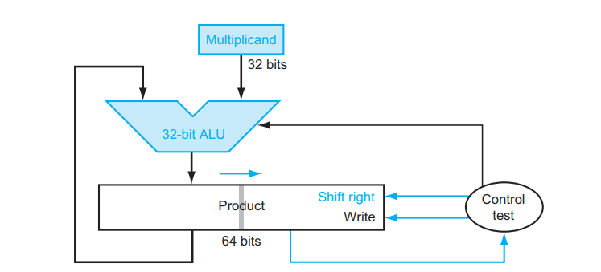
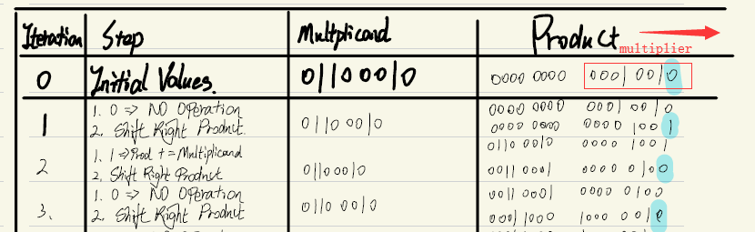
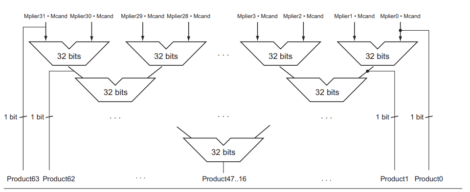
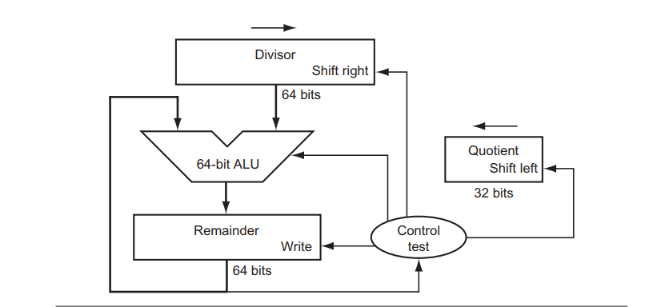
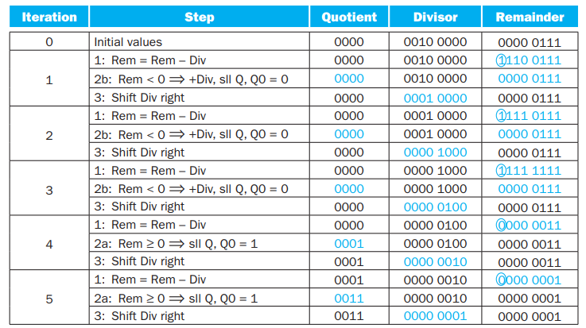

### Saturating arithmetic

- Do the arithmetic

- Check If the result is in the representing range

  - Yes

    - end

  - No
    - the result should be either the maximum or the minimum.

### Multiplication

#### By hand

#### First Version

#### Second Version

#### Faster Multiplication

### Division

> 0000 0111two by 0010two.

